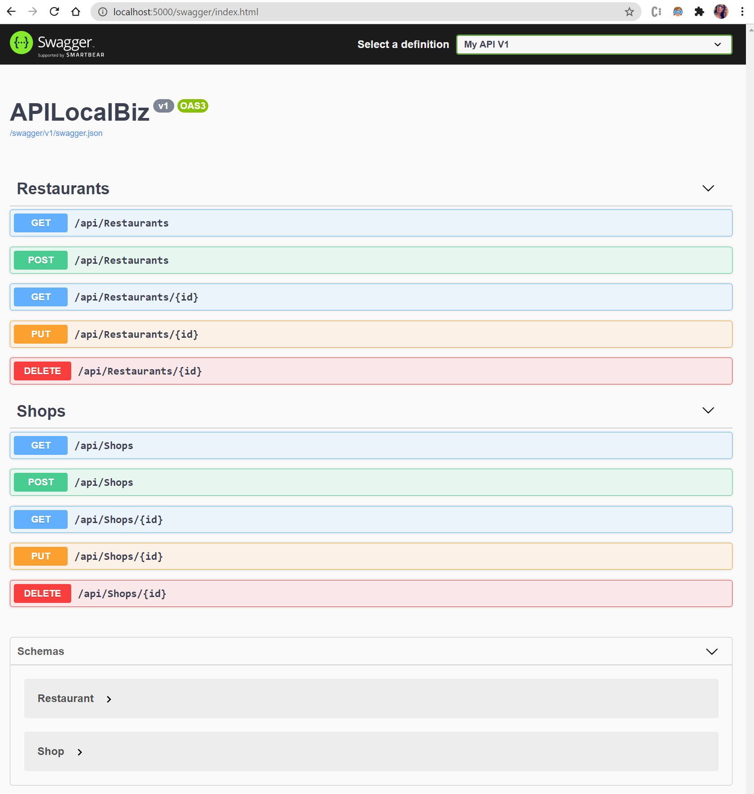

# _Local Business Lookup_

#### _C# API Solo Project For Epicodus_ 
#### _DATE 01.22.2021_

#### ✒️ By _**Tawnee Harris**_

## 	📙 Description

This application includes a custom built API with seeded data and full CRUD functionality via API endpoints.

## ⚙️ Setup/Installation Requirements

Software Requirements
* An internet browser of your choice; I prefer Chrome
* A code editor; I prefer VSCode
* .NET Core
* MySQL
* MySQL Workbench
* An API Client; I prefer Postman

Open by Downloading or Cloning
* Navigate to <https://github.com/tawneeh/LocalBiz.Solution.git>
* Download this repository to your computer by clicking the green Code button and 'Download Zip'
* Or clone the repository

AppSettings
* This project requires an AppSettings file. Create your `appsettings.json` file in the API project directory `APILocalBiz`
* Format your `appsettings.json` file as follows, including your unique password that was created at MySqlWorkbench installation:
```
{
  "Logging": {
    "LogLevel": {
      "Default": "Warning"
    }
  },
  "AllowedHosts": "*",
  "ConnectionStrings": {
    "DefaultConnection": "Server=localhost;Port=3306;database=tawnee_harris_3;uid=root;pwd=<YourPassword>;"
  }
}
```
* Update the Server, Port, and User ID as needed.

Import Database using Entity Framework Core
* Navigate to `LocalBiz.Solution/APILocalBiz` and type `dotnet ef database update` into the terminal to create your database tables.

Launch this Application
* Navigate to `LocalBiz.Solution/APILocalBiz` and type `dotnet restore` into the terminal
* Then, in the same API project directory, type `dotnet build` into the terminal followed by `dotnet run`
* Peruse full CRUD functionality via Postman or another API Client

## 	📝 API Documentation

Feel free to navigate through the API endpoints via Postman or another API Client.

* API List of Shops: `http://localhost:5000/api/shops`
* API List of Restaurants: `http://localhost:5000/api/restaurants`
* All API endpoints illustrated in the SwaggerUI screenshot below

### Certain information is also available via query.

Shop Path Parameters

| Parameter | Type | Description |
| :---: | :---: | --- |
| name | string | Return matches by name
| specialty | string | Return matches by specialty
| recommended | bool | Return restaurants either recommended: true or recommended: false |

<br>

Example Query by Shop Name
```
http://localhost:5000/api/shops/?name=Francesca's
```

JSON Response
```
    {
        "shopId": 1,
        "name": "Francesca's",
        "phone": "425-775-4712",
        "specialty": "Beautiful Dresses",
        "recommended": true
    }
```

Restaurant Path Parameters

| Parameter | Type | Description |
| :---: | :---: | --- |
| name | string | Return matches by name
| cuisine | string | Return matches by cuisine
| recommended | bool | Return restaurants either recommended: true or recommended: false |

<br>

Example Query by Restaurant Cuisine
```
http://localhost:5000/api/restaurants/?cuisine=steak
```

JSON Response
```
    {
        "restaurantId": 1,
        "name": "El Gaucho",
        "phone": "206-728-1337",
        "cuisine": "Steak",
        "recommended": true
    }
```

### Documentation Referenced for Swashbuckle Integration

* [Microsoft Docs: Swagger Overview](https://docs.microsoft.com/en-us/aspnet/core/tutorials/web-api-help-pages-using-swagger?view=aspnetcore-5.0)
* [Microsoft Docs: Get Started with Swashbuckle](https://docs.microsoft.com/en-us/aspnet/core/tutorials/getting-started-with-swashbuckle?view=aspnetcore-5.0&tabs=visual-studio)
* [GitHub Swashbuckle.AspNetCore README.md](https://github.com/domaindrivendev/Swashbuckle.AspNetCore/blob/master/README.md)

### Accessing SwaggerUI

Launch the project from the `APILocalBiz` project directory by typing `dotnet run` into the terminal. Input `http://localhost:5000/swagger` to view and interact with the Swashbuckle SwaggerUI.

#### Swagger UI Screenshot

<center>

</center>

<br>

### Note on Versioning

Implementing Versioning is always a good idea in the ever changing world of tech. I will be adding Versioning to this project in due time.

#### Documentation Reference for Future Versioning Integration

* [Versioning Package](https://www.nuget.org/packages/Microsoft.AspNetCore.Mvc.Versioning/4.1.0)
* [Tutorial 1](https://neelbhatt.com/2018/04/21/api-versioning-in-net-core/)
* [Tutorial 2](https://dev.to/99darshan/restful-web-api-versioning-with-asp-net-core-1e8g)

## 🐛 Known Bugs

This application currently does not include a Client side or API Versioning. 

## 📫 Support and contact details

Please feel free to reach out to me anytime at <tawneeh@icloud.com>

## 💾 Technologies Used

* C#
* Swagger UI
* Swashbuckle
* Microsoft.AspNetCore.Mvc.Versioning
* Entity Framework Core
* MySql
* MySql Workbench
* Postman

<br>

[](https://opensource.org/licenses/MIT)

Copyright (c) 2021 **_Tawnee Harris_** ⚖️